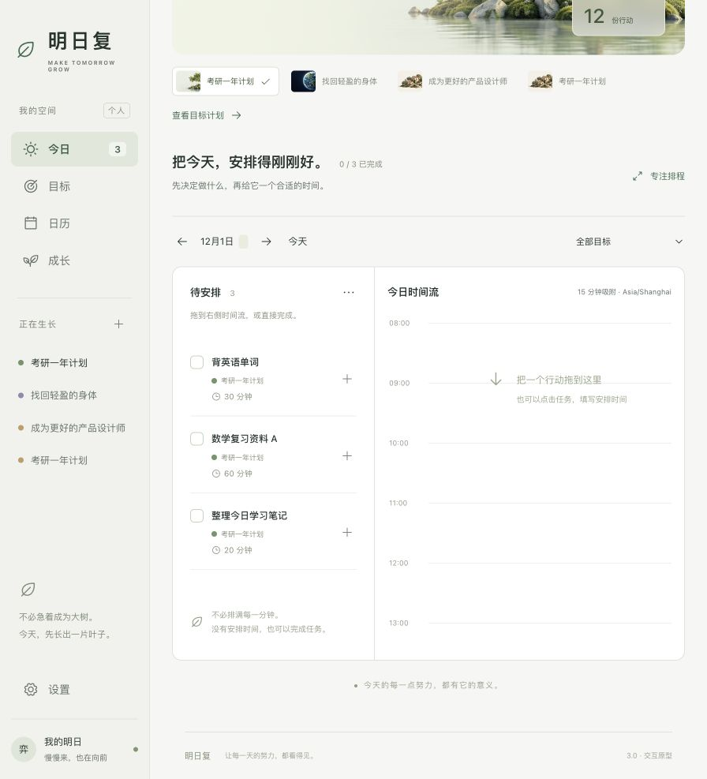
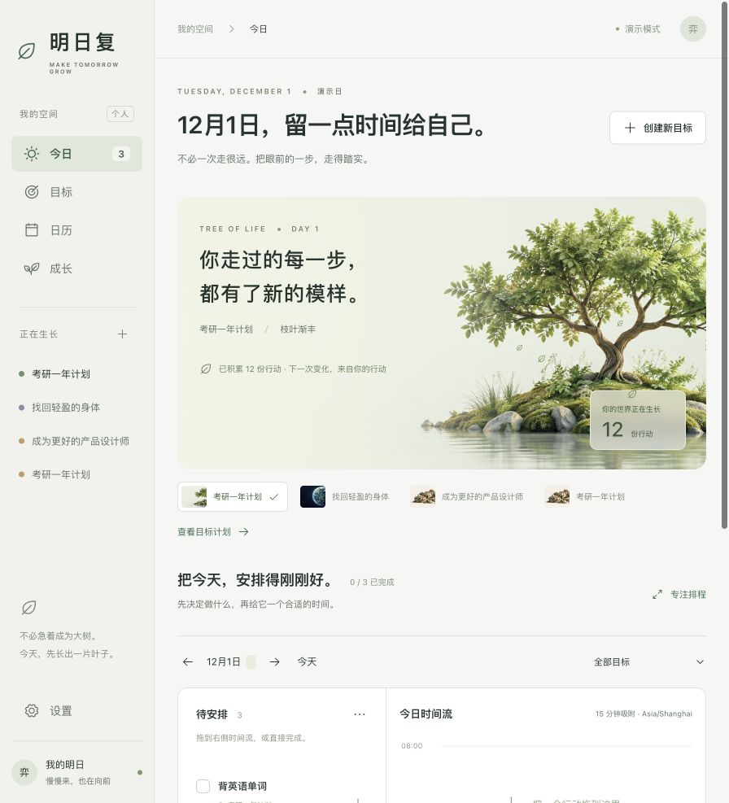

# 明日复 3.0

> 把“想做的事”变成今天可以开始的一步。

[在线体验](https://mingrifu-v3-lyc.dark-hare-4526.chatgpt.site)

明日复是一款面向有长期目标、但常在日常安排中失去节奏的年轻人的目标行动原型。它把目标拆成可审阅的月周计划和可执行的每日任务，让用户在完成、调整与撤销之间持续推进，而不是只停留在“制定计划”。

这是一个用于产品设计展示的前端交互原型：计划建议、风险判断和成长反馈均为前端模拟，不连接真实 AI 或后端服务。

## 项目信息

- **项目性质**：个人产品项目 / 高保真前端交互原型
- **项目周期**：约 3 个月
- **本人职责**：需求分析、竞品研究、产品设计、交互原型及 AI 辅助开发
- **当前版本**：V3.0

## 为什么做它

很多目标工具擅长记录待办，却没有回答三个关键问题：目标是否可行、今天该从哪里开始、计划偏离后如何继续。明日复围绕这三个时刻设计：

1. 在创建目标时，明确目标类型、期限与可投入时间。
2. 在计划生成后，让用户先审核月周安排，再进入每日执行。
3. 在执行当天，用排程、完成和撤销保留调整空间，并把实际行动沉淀为成长反馈。

## 核心功能

- **目标创建**：填写目标、期限、投入时间与目标类型，查看前端模拟的可行性提示。
- **月周计划与审核**：查看阶段、周计划和任务拆分；在进入执行前确认或修改计划。
- **每日执行**：聚焦当天任务，支持完成、撤销、失败重试和时长调整。
- **日程排程**：将任务安排到时间流中，支持拖拽排程与时间调整。
- **成长反馈**：以树木、城市、星球等视觉场景呈现行动积累，让进度从数字变成可感知的变化。

## 主要产品流程

```text
创建目标 → 前端模拟可行性判断 → 审核月周计划
    → 生成今日任务 → 排程与执行 → 完成 / 撤销 / 调整
    → 查看目标进度与成长场景反馈
```

## 从 V1 到 V3

| 版本 | 迭代重点 | 产品判断 |
| --- | --- | --- |
| V1 | 用 AI 将目标按“月—周—日”拆解。 | 计划无法修改，且按月拆解并不适合所有目标。 |
| V2 | 保持核心拆解逻辑，完善前端并形成 Web 应用。 | 可用性提升，但缺乏让用户愿意持续使用的吸引力。 |
| V3 | 完善从计划到执行的闭环，加入成长世界与完成反馈。 | 在完成、调整与可见的正向反馈中，帮助用户持续推进目标。 |

## 项目截图

截图位于 [`docs/design-audit/`](docs/design-audit/)；它们记录 V3 的页面审阅状态，可用于快速了解原型界面。





## 技术实现

- React 19 + Vite 6
- Phosphor Icons
- CSS 组件样式与响应式布局
- `sessionStorage` 保存浏览器会话内的原型数据；刷新同一会话会保留，关闭会话或清理浏览器数据后会重置
- `worker/` 与 `scripts/prepare-sites-build.mjs` 用于静态站点部署构建适配

### 目录结构

```text
src/                 React 页面、组件、状态与样式
public/assets/       V3 场景素材（树木、城市、星球）
tests/               单元与交互逻辑测试
docs/design-audit/   V3 页面截图与审阅记录
worker/              部署入口
scripts/             构建前处理脚本
```

## 本地运行

需要 Node.js 18 或更新版本，以及 npm。

```bash
npm ci
npm run dev
```

启动后按终端提示打开本地地址（Vite 默认使用 `http://localhost:5173`；端口被占用时会自动顺延）。

### 常用命令

```bash
# 运行测试
npm test

# 生产构建
npm run build

# 本地预览构建结果
npm run preview
```

V3 不需要环境变量，`.env.example` 仅说明未来服务接入时的本地配置约定。

## V4 的后续方向

下一轮将围绕更可信的可行性判断、阶段到周到日的连续调整、持久化数据与真实服务接入继续收敛，并重新验证成长反馈是否真正帮助用户开始行动。
